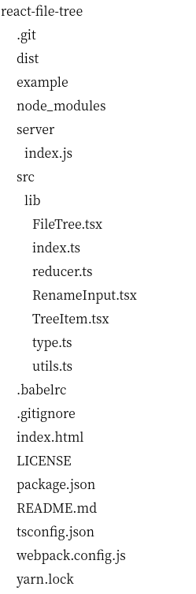

# react-file-tree



## Install

```bash
yarn add @sinm/react-file-tree
```

## Usage

参考[example/Tree.tsx](example/tree.tsx)

## Demo

```
git clone https://github.com/pansinm/react-file-tree.git
cd react-file-tree
yarn
yarn start
```