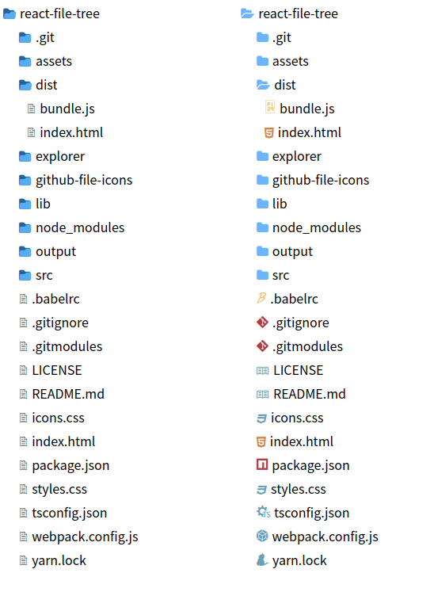

# react-file-tree




## Install

```bash
yarn add @sinm/react-file-tree
```

## Usage

1. Render tree
```tsx
import { FileTree } from '@sinm/react-file-tree';
// default style
import '@sinm/react-file-tree/styles.css';

const [tree, setTree] = useState(defaultTree);

<FileTree tree={tree}>
```

2. Toggle expanded

```tsx
const toggleExpanded: FileTreeProps["onItemClick"] = (treeNode) => {
    setTree((tree) =>
        utils.assignTreeNode(tree, treeNode.uri, {
        expanded: !treeNode.expanded,
        })
    );
};

<FileTree
    tree={tree}
    onItemClick={toggleExpanded}
/>
```

3. use [github-file-icons](https://github.com/homerchen19/github-file-icons)
```tsx
import FileItemWithFileIcon from '@sinm/react-file-tree/lib/FileItemWithFileIcon';
import FileItemWithFileIcon from '@sinm/react-file-tree/icons.css';
const itemRenderer = (treeNode: TreeNode) => <FileItemWithFileIcon treeNode={treeNode} />

<FileTree tree={tree} itemRenderer={itemRenderer} />
```

4. Load tree from server

```tsx
// backend
import {getTreeNode} from '@sinm/react-file-tree/lib/node';

app.get('/root', async (req, res, next) => {
    try {
        const tree = await getTreeNode('.'); // build tree for current directory 
        res.send(tree);
    } catch(err) {
        next(err)
    }
})

// frontend
useEffect(() => {
    fetch("/root")
        .then((res) => res.json())
        // expand root node
        .then((tree) => Object.assign(tree, { expanded: true }))
        .then(setTree);
}, []);

```


## Demo

```
git clone https://github.com/pansinm/react-file-tree.git
cd react-file-tree
yarn
git submodule update --init --recursive
yarn start
```
